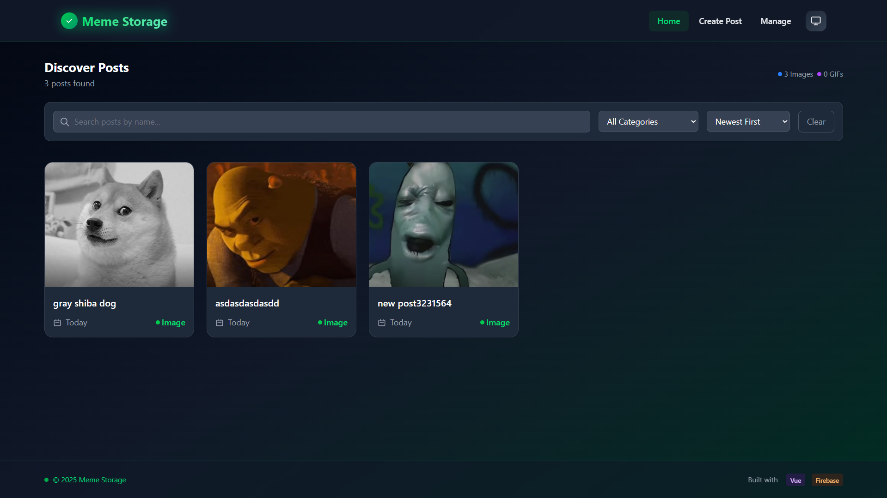

# 🧠 Meme Storage

A modern **Vue 3 + Firebase** web application for storing and managing memes — whether they’re hilarious images or looping GIFs.  
Designed with a clean, futuristic interface, **Meme Storage** brings simplicity, speed, and an intuitive experience powered by the latest web technologies.

---

## 📸 Screenshot



## ✨ Features

- 🟢 **CRUD Operations** — Create, edit, and delete memes with real-time Firestore integration.
- 🖼️ **Category Support** — Classify memes by type (`image` or `gif`).
- 🧩 **Modern UI/UX** — Minimal, glassy design inspired by 2025 web trends.
- 🌙 **Dark / Light / System Themes** — Seamless theme switching with local preference saving.
- 🔥 **Firebase Backend** — Data persistence and scalability via Firestore.
- 🧱 **Responsive Layout** — Beautiful across all devices: mobile, tablet, and desktop.
- 💬 **Toast Notifications** — Realtime success/error feedback using [vue-sonner](https://github.com/emilkowalski/vue-sonner).

---

## 🧩 Tech Stack

| Tech                                                     | Description                      |
| -------------------------------------------------------- | -------------------------------- |
| [Vue 3](https://vuejs.org/)                              | Progressive JavaScript Framework |
| [Vite](https://vitejs.dev/)                              | Lightning-fast build tool        |
| [Tailwind CSS](https://tailwindcss.com/)                 | Utility-first modern styling     |
| [Firebase](https://firebase.google.com/)                 | Firestore Database & App Config  |
| [vue-sonner](https://github.com/emilkowalski/vue-sonner) | Toast notifications              |
| [lucide-vue-next](https://www.lucide.dev/)               | Modern icon library for Vue      |

---

## ⚙️ Project Setup

### 1️⃣ Install dependencies

```bash
npm install
```

### 2️⃣ Create `.env` file

Copy the Firebase credentials from your Firebase Console into a `.env` file at the project root:

```bash
VITE_FIREBASE_API_KEY=your_api_key
VITE_FIREBASE_AUTH_DOMAIN=your_auth_domain
VITE_FIREBASE_PROJECT_ID=your_project_id
VITE_FIREBASE_STORAGE_BUCKET=your_storage_bucket
VITE_FIREBASE_MESSAGING_SENDER_ID=your_sender_id
VITE_FIREBASE_APP_ID=your_app_id
```

### 3️⃣ Run the development server

```bash
npm run dev
```

Then open the URL shown in your terminal (usually [http://localhost:5173](http://localhost:5173)).

---

## 🧠 Firebase Configuration

In `/src/config/firebase.js`:

```js
import { initializeApp } from "firebase/app";
import { getFirestore, collection } from "firebase/firestore";

const firebaseConfig = {
  apiKey: import.meta.env.VITE_FIREBASE_API_KEY,
  authDomain: import.meta.env.VITE_FIREBASE_AUTH_DOMAIN,
  projectId: import.meta.env.VITE_FIREBASE_PROJECT_ID,
  storageBucket: import.meta.env.VITE_FIREBASE_STORAGE_BUCKET,
  messagingSenderId: import.meta.env.VITE_FIREBASE_MESSAGING_SENDER_ID,
  appId: import.meta.env.VITE_FIREBASE_APP_ID,
};

const app = initializeApp(firebaseConfig);
const db = getFirestore(app);
const postsCollection = collection(db, "posts");

export { db, postsCollection };
```

---

## 📂 Firestore Structure

Collection: **`posts`**

| Field       | Type      | Description                 |
| ----------- | --------- | --------------------------- |
| `name`      | string    | Meme name                   |
| `url`       | string    | Direct image/gif URL        |
| `category`  | string    | Either `image` or `gif`     |
| `createdAt` | timestamp | Auto-generated when created |

---

## 🖥️ Pages Overview

| Page                | Path        | Description                                             |
| ------------------- | ----------- | ------------------------------------------------------- |
| 🏠 **Home**         | `/`         | View all memes in a responsive grid                     |
| 🆕 **Create Post**  | `/create`   | Add new meme (with name, URL, and category)             |
| ✏️ **Edit Post**    | `/edit/:id` | Update meme info                                        |
| ⚙️ **Manage Posts** | `/manage`   | View memes in a table and perform actions (edit/delete) |

---

## 🌗 Theming

- **Modes:** `Light`, `Dark`, `System`
- Automatically syncs with system settings.
- Persistent across sessions via `localStorage`.

Toggle theme from the navbar (icon updates automatically).

---

## 📱 Responsive Design

Optimized for:

- 💻 Desktop (Full table & grid views)
- 📱 Mobile (Adaptive cards, stacked layout)
- 🧭 Tablet (Fluid transitions, clean spacing)

---

## 🧾 License

This project is open-source under the [MIT License](LICENSE).

---

## 💚 Author

Created with 💚 by [**mtrong100**](https://github.com/mtrong100)

---

## 🚀 Demo (Optional)

_You can deploy this project easily using [Vercel](https://vercel.com/) or [Netlify](https://www.netlify.com/)._  
Just connect your repo and set the environment variables.

---

> “Meme Storage – because even the funniest memes deserve a beautiful home.” 😎
